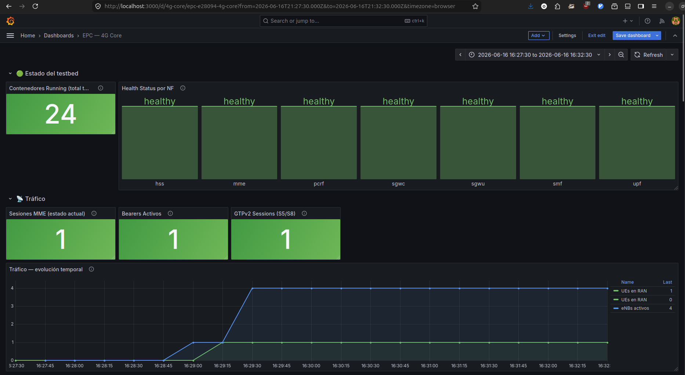
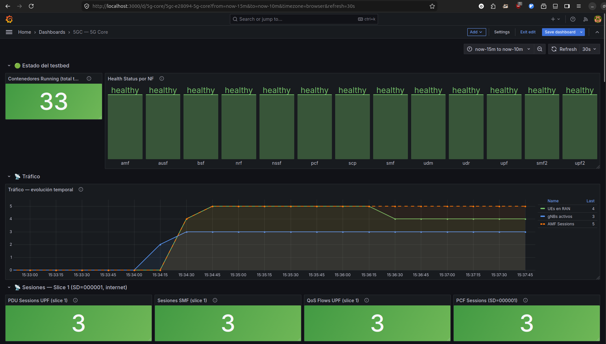
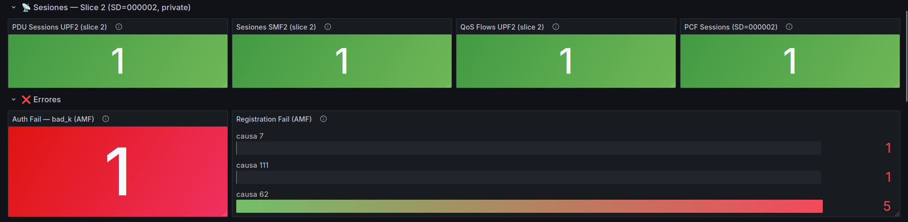
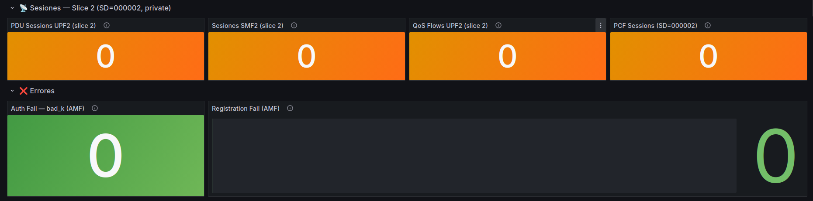
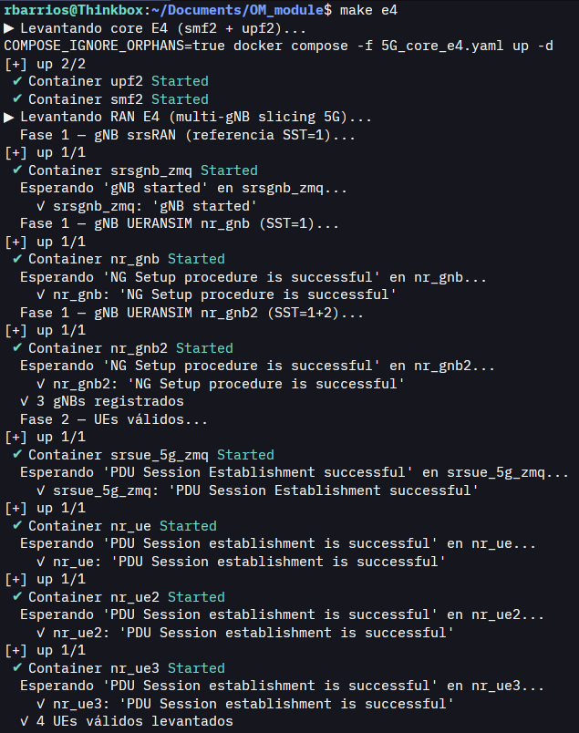

# OM_module - 4G/5G Testbed with Full Observability

[](LICENSE)
[](https://golang.org/)
[](https://open5gs.org/)
[](https://www.srsran.com/)
[](https://github.com/aligungr/UERANSIM)
[](https://prometheus.io/)
[](https://grafana.com/)
[](https://grafana.com/oss/loki/)
[](https://grafana.com/oss/tempo/)
[](https://docs.docker.com/compose/)

---

## Overview

This project is a containerized 4G/5G mobile network testbed developed as a PUCP thesis prototype. It extends the [docker_open5gs](https://github.com/herlesupreeth/docker_open5gs) project with a custom **Operations & Maintenance (O&M) module** designed to improve the learning experience in mobile network labs.

The testbed runs Open5GS as the 4G/5G core and srsRAN/UERANSIM as the radio access network simulator. On top of the network stack, the O&M module provides **full observability**: per-container resource metrics, structured log aggregation, and distributed traces that correlate signaling events across network functions - S1AP, NGAP, GTPv2, PFCP, Diameter, and 5G SBI.

Four test scenarios (E1–E4) cover both 4G and 5G with normal attach/registration flows and controlled fault injection (wrong Ki, invalid APN/DNN, bad IMSI/SUPI, wrong DNN/SD), allowing students to observe how the core responds to authentication and session errors in real time.

---

## Architecture

```
┌─────────────────────────────────────────────────────────────────┐
│  RAN Layer                                                      │
│  srsRAN (eNB/gNB + UE)  ·  UERANSIM (gNB + UE)                  │
└──────────────┬──────────────────────────┬───────────────────────┘
               │ S1AP / NGAP / GTPv1-U    │
┌──────────────▼──────────────────────────▼───────────────────────┐
│  Core Layer                                                     │
│  Open5GS EPC (MME · HSS · SGWC/U · SMF · UPF · PCRF)            │
│  Open5GS 5GC (AMF · NRF · AUSF · UDM · UDR · PCF · NSSF ·       │
│               BSF · SCP · SMF · UPF)                            │
│  E4 slice extension (SMF2 · UPF2 - SST=1 SD=000002)             │
└──────────────┬──────────────────────────────────────────────────┘
               │ Docker bridge capture (SCTP · UDP)
               │ GTPv2 · PFCP · Diameter · SBI
┌──────────────▼──────────────────────────────────────────────────┐
│  O&M Module (Go)                                                │
│  Container discovery · tshark capture · Prometheus exporter     │
│  OTLP span emission · REST API                                  │
└──────────┬───────────────┬──────────────────┬───────────────────┘
           │ scrape        │ OTLP/HTTP        │ logs
    ┌──────▼──────┐  ┌─────▼──────┐  ┌───────▼──────┐
    │ Prometheus  │  │   Tempo    │  │     Loki     │
    └──────┬──────┘  └────────────┘  └──────────────┘
           │ PromQL / LogQL / TraceQL
    ┌──────▼──────┐
    │   Grafana   │
    └─────────────┘
```

### Component Overview

| Component | Role | Compose file |
|---|---|---|
| Open5GS EPC | 4G core: MME, HSS, SGWC, SGWU, SMF, UPF, PCRF | `4G_core.yaml` |
| Open5GS 5GC | 5G core: AMF, NRF, AUSF, UDM, UDR, PCF, NSSF, BSF, SCP, SMF, UPF | `5G_core.yaml` |
| SMF2 + UPF2 | E4 slice extension: SST=1 SD=000002, DNN=private, subnet 192.168.200.0/24 | `5G_core_e4.yaml` |
| srsRAN / UERANSIM | RAN simulation (eNB/gNB + UE, ZMQ transport) | `ran.yaml` |
| O&M Module | Packet capture, metrics exporter, REST API, OTLP tracing | `services.yaml` |
| Prometheus | Metrics collection & storage | `services.yaml` |
| Grafana | Dashboards & visualization | `services.yaml` |
| Loki + Promtail | Log aggregation & structured log shipping | `services.yaml` |
| Tempo | Distributed tracing backend | `services.yaml` |
| json-exporter | Prometheus adapter for Open5GS REST API metrics (UE/session counts) | `services.yaml` |

---

### Software requirements

- **Docker Engine** ≥ 29 (tested on 29.3.1)
- **Docker Compose** v2 (`docker compose`, tested on v5.1.1)
- **GNU Make** ≥ 4.3
- **Linux host** - packet capture requires access to Docker bridge interfaces (`NET_ADMIN`, `NET_RAW`); the O&M container runs with `network_mode: host`
- **8 GB RAM** minimum recommended (more for E4 with multiple gNBs)

> `tshark` (Wireshark CLI) is **included inside the O&M container image** - you do not need to install it on the host.

### Host configuration (required before first deploy)

These steps must be completed once on the host machine before cloning or deploying.

**1. Add your user to the docker group**

All `make` and `docker compose` commands run without `sudo`. If your user is not in the `docker` group they will fail with permission errors:

```bash
sudo usermod -aG docker $USER
newgrp docker          # apply immediately without logging out
```

**2. Export `DOCKER_GID` in your shell profile**

Prometheus runs as `user: "65534:${DOCKER_GID}"` inside its container in order to access the Docker socket (`/var/run/docker.sock`). The GID of the `docker` group varies between Linux distributions and installations, so it must be resolved dynamically.

Add the following to `~/.bashrc` (or `~/.zshrc`):

```bash
export DOCKER_GID=$(getent group docker | cut -d: -f3)
```

Then reload your shell:

```bash
source ~/.bashrc
```

This ensures `DOCKER_GID` is always correct in every new session without requiring manual updates to `.env` if Docker is reinstalled or the host is migrated.

---

## Setup - Pull Docker Images

Pull the base images before first use.

```bash
# Open5GS core image
docker pull ghcr.io/herlesupreeth/docker_open5gs:master
docker tag ghcr.io/herlesupreeth/docker_open5gs:master docker_open5gs

# srsRAN LTE (eNB + UE for 4G)
docker pull ghcr.io/herlesupreeth/docker_srslte:master
docker tag ghcr.io/herlesupreeth/docker_srslte:master docker_srslte

# srsRAN Project (gNB + UE for 5G)
docker pull ghcr.io/herlesupreeth/docker_srsran:master
docker tag ghcr.io/herlesupreeth/docker_srsran:master docker_srsran

# UERANSIM (alternative gNB + UE for 5G)
docker pull ghcr.io/herlesupreeth/docker_ueransim:master
docker tag ghcr.io/herlesupreeth/docker_ueransim:master docker_ueransim
```

Verify the images were tagged correctly before continuing:

```bash
docker images | grep -E "docker_open5gs|docker_srslte|docker_srsran|docker_ueransim"
```

The O&M module image (`docker_om_module`) is built locally from `./om-module` and must be built before the first deploy:

```bash
docker compose -f services.yaml build om-module
```

Docker Compose will use the cached image on subsequent deploys. To force a rebuild (e.g. after modifying the Go source):

```bash
docker compose -f services.yaml build --no-cache om-module
```

---

## Quick Start

### Recommended startup order

```bash
# Step 1 - Start the core (choose one)
make core-4g-up       # 4G core (Open5GS EPC: MME, HSS, SGWC/U, SMF, UPF, PCRF)
make core-5g-up       # 5G core (Open5GS 5GC: AMF, NRF, AUSF, UDM, UDR, PCF, ...)

# Step 2 - Start the observability + O&M stack (after core is up)
make services-up

# Step 3 - Provision subscriber data (MongoDB must be running)
bash scripts/mongo_insert.sh

# Step 4 - Launch a scenario (choose one)
make e1               # E1 - Basic 4G attach
make e2               # E2 - Multi-eNB 4G with fault injection
make e3               # E3 - Basic 5G registration (srsRAN)
make e4               # E4 - Multi-gNB slicing (automatically starts smf2+upf2)

# Step 5 - Generate traffic
make traffic
```

> **E4 note:** `make e4` automatically brings up `smf2` and `upf2` via `5G_core_e4.yaml` before launching the RAN. The base core (`make core-5g-up`) must already be running. No manual compose step is needed.

> **Startup order is mandatory:** `make services-up` and all RAN profiles depend on the Docker network `docker_open5gs_default`, which is created by the core compose files. Running `make services-up` before the core will fail with `network docker_open5gs_default not found`. Always verify the network exists before proceeding:
> ```bash
> docker network ls | grep open5gs
> ```

Run `make help` to see all available targets.

### Verify the stack is healthy

After step 2, confirm all services are up before launching a scenario:

```bash
# Check all containers are running and healthy
docker compose -f services.yaml ps

# Individual health checks
curl -s http://localhost:9090/-/healthy    # Prometheus
curl -s http://localhost:3100/ready        # Loki
curl -s http://localhost:3200/ready        # Tempo
curl -s http://localhost:8080/ping         # O&M module
```

All four should return a 200 response. If Prometheus is unhealthy, verify that `DOCKER_GID` is correctly set in your environment (see [Host configuration](#host-configuration-required-before-first-deploy)).

---

## Test Scenarios

The four scenarios are designed in two parallel pairs for direct 4G↔5G comparison:

- **E1 ↔ E3** - baseline complete flow: same sequence of events (attach/registration → bearer/PDU session → traffic → detach/deregistration), different architecture
- **E2 ↔ E4** - multi-RAN node + fault injection: same fault categories (identity, authentication, session), different core and slicing

| Scenario | Generation | RAN | Description | Makefile |
|---|---|---|---|---|
| E1 | 4G | srsRAN LTE | 1 eNB + 1 valid UE - full EPS Attach → Bearer → Traffic → Detach flow | `make e1` |
| E2 | 4G | srsRAN LTE | 4 independent eNB+UE pairs - 1 valid + 3 fault-injected (wrong Ki, bad IMSI, wrong APN) | `make e2` |
| E3 | 5G | srsRAN Project (default) or UERANSIM | 1 gNB + 1 valid UE - full 5G Registration → PDU Session → Traffic → Deregistration flow | `make e3` / `make e3-ueransim` |
| E4 | 5G | srsRAN Project + UERANSIM | 3 gNBs + network slicing (SST=1 SD=000001 / SST=1 SD=000002) + dedicated SMF+UPF per slice + 4 valid UEs + 4 fault-injected UEs | `make e4` |

### E2 - UE distribution (4G fault injection)

| Container | eNB | IMSI | Fault mechanism | Expected failure |
|---|---|---|---|---|
| `srsue_zmq` | eNB1 | 895 | None (valid) | ✅ Attach successful |
| `srsue_zmq_bad_ki` | eNB2 | 902 | Wrong Ki in `.conf` (DB entry correct) | ❌ `Authentication failure (MAC failure)` - `OGS_NAS_EMM_CAUSE[20]` |
| `srsue_zmq_bad_imsi` | eNB3 | 901 | **IMSI not in MongoDB** | ❌ `Attach reject` - `OGS_NAS_EMM_CAUSE[8]` (IMSI unknown in HLR) |
| `srsue_zmq_bad_apn` | eNB4 | 903 | Wrong APN in `.conf` (DB entry correct) | ⚠️ Attach succeeds, PDN rejected - `Invalid APN` (ESM layer) |

### E4 - UE distribution (5G slicing + fault injection)

E4 implements **true network slicing with user plane isolation**: two independent SMF+UPF pairs, each serving a distinct slice with a separate UE IP subnet.

| Slice | S-NSSAI | DNN | SMF | UPF | UE subnet |
|---|---|---|---|---|---|
| Slice 1 | SST=1 SD=000001 | internet | `smf` | `upf` | 192.168.100.0/24 |
| Slice 2 | SST=1 SD=000002 | private | `smf2` | `upf2` | 192.168.200.0/24 |

| Container | gNB | IMSI | Slice | Expected result |
|---|---|---|---|---|
| `srsue_5g_zmq` | srsgnb_zmq | 895 | SST=1 SD=000001 (internet) | ✅ Registration + PDU → 192.168.100.x |
| `nr_ue` | gNB1 (UERANSIM) | 896 | SST=1 SD=000001 (internet) | ✅ Registration + PDU → 192.168.100.x |
| `nr_ue2` | gNB2 (UERANSIM) | 898 | SST=1 SD=000001 (internet) | ✅ Registration + PDU → 192.168.100.x |
| `nr_ue3` | gNB2 (UERANSIM) | 899 | SST=1 SD=000002 (private) | ✅ Registration + PDU → 192.168.200.x via smf2/upf2 |
| `nr_ue_bad_supi` | gNB1 | 905 | SST=1 SD=000001 | ❌ **SUPI not in MongoDB** → `Cannot find SUCI [404]` → Reject [7] |
| `nr_ue_bad_ki` | gNB1 | 906 | SST=1 SD=000001 | ❌ Wrong K in `.yaml` (DB correct) → `Auth failure MAC` → Reject [111] |
| `nr_ue_bad_dnn` | gNB1 | 908 | SST=1 SD=000001 | ⚠️ Registration succeeds, `DNN_NOT_SUPPORTED_OR_NOT_SUBSCRIBED` |
| `nr_ue_bad_sst` | gNB2 | 909 | SST=1 SD=000003 (non-existent) | ❌ `Cannot find Requested NSSAI [SST:1 SD:0x3]` → Reject [62] |

### Access Grafana

Open <http://localhost:3000> in a web browser. Login with the following credentials:

```
Username : open5gs
Password : open5gs
```

### Teardown

```bash
make e1-down          # Stop only the RAN for E1 (core + services stay up)
make e2-down          # Stop RAN for E2
make e3-down          # Stop RAN for E3 (srsRAN)
make e3-ueransim-down # Stop RAN for E3 (UERANSIM)
make e4-down          # Stop all RAN profiles + smf2/upf2 for E4
make down             # Stop everything (RAN + core + services)
```

---

## Scenario Evidence

Every scenario run is backed by reproducible evidence committed to the repository:

### Sample captures

**E2 (4G, multi-eNB with fault injection): core dashboard with RAN and traffic active**



**E4 (5G, multi-gNB slicing): core dashboard with RAN and traffic active**



**Slice isolation evidence: slice 2 panels active in E4 vs. all counters at zero in E3**

| E4 (slice 2 deployed) | E3 (no slice 2) |
|---|---|
|  |  |

**Deployment: terminal output of `make e4` (phase 1)**



Full capture sets for all four scenarios and the complete deployment lifecycle are available under [`figuras/`](figuras/).

---

## Provisioning Subscriber Data

### Automated (recommended)

Run after `make core-4g-up` or `make core-5g-up`. Before running, verify MongoDB is ready to accept connections - the container may be marked as `Up` while `mongod` is still initializing:

```bash
docker exec mongo mongosh --eval "db.adminCommand('ping')"
# Expected: { ok: 1 }
```

Once ready, insert all subscribers:

```bash
bash scripts/mongo_insert.sh
```

The script drops existing subscribers and inserts all UEs needed for E1–E4. It is idempotent - safe to run multiple times. Subscribers provisioned:

| IMSI | Scenario | Role |
|---|---|---|
| `001011234567895` | E1 / E3 / E4 | Valid UE (base) - works for 4G and 5G |
| `001011234567896` | E3 / E4 | Valid 5G UE - SST=1 SD=000001 (internet) |
| `001011234567898` | E4 | Valid 5G UE - SST=1 SD=000001 (internet), gNB2 |
| `001011234567899` | E4 | Valid 5G UE - SST=1 SD=000002 (private), routed to smf2/upf2 |
| `001011234567902` | E2 | DB entry correct, srsue config has **wrong Ki** → auth failure |
| `001011234567903` | E2 | DB entry correct, srsue config has **wrong APN** → PDN reject |
| `001011234567906` | E4 | DB correct, config has **wrong K** → auth failure at AUSF |
| `001011234567908` | E4 | DB correct, config has **wrong DNN** → PDU reject at SMF |
| `001011234567909` | E4 | DB correct (SD=000001), config requests **SD=000003** → reject at AMF |

> **Not inserted intentionally**: IMSI `001011234567901` (bad_imsi E2) and `001011234567905` (bad_supi E4). Their absence from MongoDB *is* the fault injection - the core returns `Unknown UE`.

### Manual (fallback)

Open <http://localhost:9999> (credentials: `admin` / `1423`) to add subscribers one by one via the Open5GS WebUI.

Default UE credentials from `.env`:

```
IMSI : 001011234567895
Ki   : 8baf473f2f8fd09487cccbd7097c6862
OP   : 11111111111111111111111111111111
```

---

## Traffic Generation

```bash
make traffic
```

Runs `scripts/traffic.sh`, which executes ping from all active UE containers. Works for any scenario currently up. For E4, `nr_ue3` sends traffic through `upf2` (DNN=private, subnet 192.168.200.x) while the other UEs go through `upf` (DNN=internet, subnet 192.168.100.x) - demonstrating user plane isolation between slices.

---

## O&M Module

### What it does

The O&M module is a Go service (`./om-module`) that runs alongside the testbed and provides:

1. **Container discovery** - connects to the Docker daemon, filters containers by Compose project label (`om.*` taxonomy: domain, nf, generation, project), and maintains a live snapshot refreshed every 15 seconds.
2. **Packet capture** - spawns `tshark` as a subprocess on the Docker bridge interface (`auto`-detected or explicitly configured). Captures SCTP (S1AP/NGAP), UDP (GTPv2/PFCP), TCP (Diameter), and HTTP/2 (5G SBI). Parses Elastic-JSON output and emits one OTLP span per packet to Grafana Tempo.
3. **Prometheus metrics** - exposes container resource metrics and capture pipeline counters at `/metrics`.
4. **REST API** - four endpoints for integration and monitoring.

## License

MIT License - Copyright 2026 Rodrigo Barrios.

Helper scripts derived from [docker_open5gs](https://github.com/herlesupreeth/docker_open5gs) are BSD 2-Clause - Copyright Supreeth Herle.
